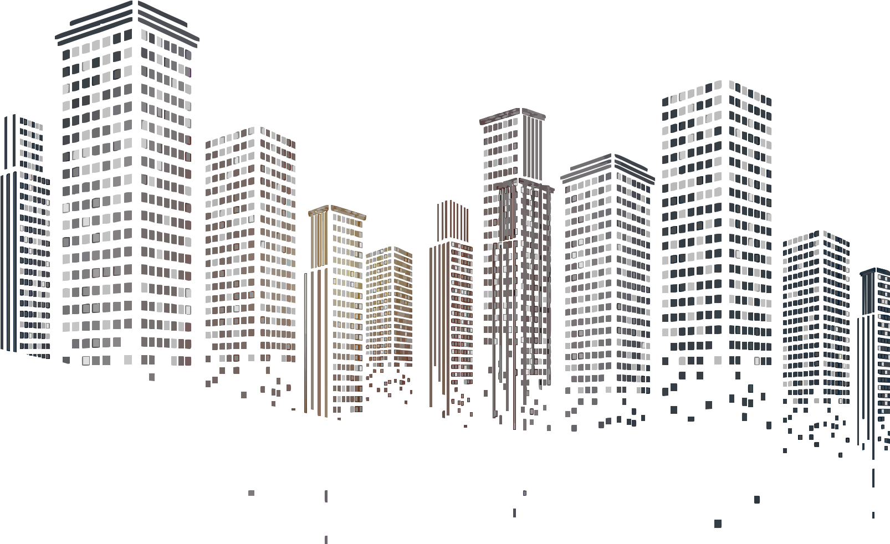

# Building Rise Animation Implementation Guide

This guide provides step-by-step instructions for implementing and customizing the building rise animation for the Nexprop landing page.

## Overview

The animation creates a visually engaging effect where buildings rise from the bottom of the screen and then gently float, emphasizing Nexprop's focus on real estate and property management.



## Implementation Options

We've created two implementations:

1. **Basic Animation**: A single building SVG that rises from bottom
2. **Advanced Animation**: Multiple building layers that rise in sequence for a parallax-like effect

## Step 1: Choose Your Implementation

### Option A: Basic Animation

Use `partials/hero-section.html` for a simple implementation that works well on all devices.

```html
<!-- Include in your HTML head -->
<link rel="stylesheet" href="/assets/css/building-animation.css">

<!-- Include before closing body tag -->
<script src="/assets/js/building-animation.js"></script>
```

### Option B: Advanced Multi-Layer Animation

Use `partials/hero-section-advanced.html` for a more dynamic effect with buildings that appear to rise in layers.

```html
<!-- Include in your HTML head -->
<link rel="stylesheet" href="/assets/css/building-animation.css">

<!-- Include before closing body tag -->
<script src="/assets/js/building-animation.js"></script>
<script src="/assets/js/svg-building-splitter.js"></script>
```

## Step 2: Customize the Animation

### Timing and Easing

Adjust the timing and easing functions in `building-animation.css`:

```css
/* Make animation faster or slower */
.building-animation {
    animation: rise-buildings 1.2s cubic-bezier(0.25, 0.46, 0.45, 0.94) forwards; /* Faster */
    /* or */
    animation: rise-buildings 2s cubic-bezier(0.25, 0.46, 0.45, 0.94) forwards; /* Slower */
}

/* Change the easing function for different effects */
/* More at https://easings.net/ */
@keyframes rise-buildings {
    0% {
        transform: translateY(100%);
        opacity: 0.8;
    }
    100% {
        transform: translateY(0);
        opacity: 1;
    }
}
```

### Float Animation

Adjust the floating effect after the buildings rise:

```css
@keyframes float-buildings {
    0%, 100% {
        transform: translateY(0);
    }
    50% {
        transform: translateY(-15px); /* Larger movement */
        /* or */
        transform: translateY(-5px); /* Smaller movement */
    }
}
```

## Step 3: Creating Multiple Building Layers (Advanced)

For the advanced animation with multiple building layers, you have two options:

### Option A: Use the Same SVG with Different Styles

This is the simplest approach and is already implemented in the advanced hero section.

1. Use the same SVG for all layers but apply different styles to create an illusion of depth
2. Adjust the animation timing for each layer

### Option B: Split Your SVG Into Multiple Layers

For true multi-layer animation, you can split your building SVG:

1. Open the SVG file directly in a browser
2. Open the browser console and paste the code from `svg-building-splitter.js`
3. Run the `splitBuildingSvg()` function to generate three separate SVGs
4. Save each SVG as a separate file and use them in your HTML

Alternatively, use the `createBuildingLayers()` function which dynamically creates the layers from a single SVG:

```javascript
// Call this function after the page loads
document.addEventListener('DOMContentLoaded', createBuildingLayers);
```

## Step 4: Performance Optimization

### Preloading

The animation script already includes image preloading for smooth animation. If you add more images, update the preload array:

```javascript
function preloadImages() {
    const imageUrls = [
        '/assets/images/building-vector-png-clipart-background.svg',
        '/assets/images/building-layer-middle.svg', // Add if using multiple SVGs
        '/assets/images/building-layer-front.svg'   // Add if using multiple SVGs
    ];
    
    imageUrls.forEach(url => {
        const img = new Image();
        img.src = url;
    });
}
```

### Accessibility

The animation includes reduced motion preferences to respect user settings:

```css
@media (prefers-reduced-motion: reduce) {
    .building-animation {
        animation: rise-buildings 0.5s linear forwards;
    }
}
```

## Creating Your Own Building SVG Layers

If you want to create your own custom building layers:

1. Start with a single building SVG
2. Create 2-3 copies of the SVG for different layers
3. In each SVG, keep only the parts you want for that layer:
   - Background layer: Distant buildings, skyline
   - Middle layer: Medium-distance buildings
   - Front layer: Closest, most detailed buildings
4. Save each as a separate SVG file
5. Update the HTML to use your custom SVG files:

```html
<div class="building-animation-wrapper" aria-hidden="true">
    
</div>

<div class="building-animation-wrapper" aria-hidden="true">
    
</div>

<div class="building-animation-wrapper" aria-hidden="true">
    
</div>
```

## Troubleshooting

If the animation doesn't work as expected:

1. Check browser console for errors
2. Ensure all CSS and JS files are properly loaded
3. Verify the SVG files are accessible at the specified paths
4. Try forcing a repaint with `void buildingElement.offsetWidth` in the JavaScript
5. Test with simplified SVGs if performance is an issue on mobile devices

## Additional Effects to Consider

- Add slight horizontal floating movement
- Implement a day-to-night transition effect
- Add subtle cloud animations in the background
- Include animated windows that light up after buildings rise
- Add small animated elements (birds, planes) for extra liveliness 